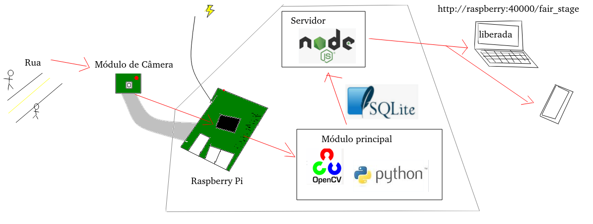
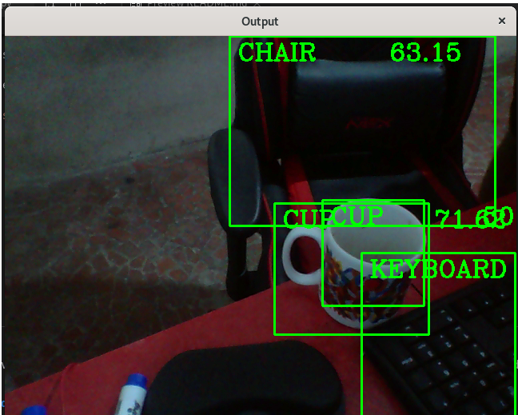
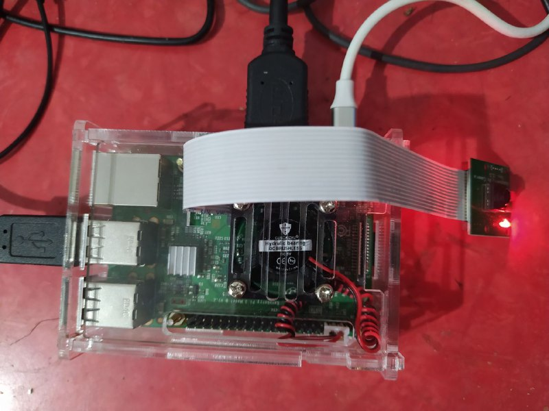
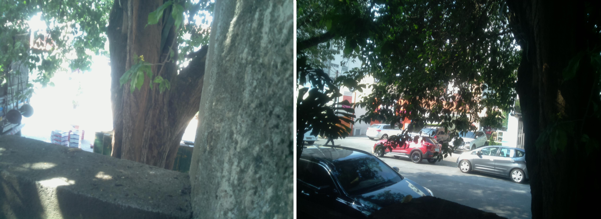

# Detecção de Feira

## Introdução

### O problema

Em São Paulo, feiras-livres, ou feiras-de rua são tradicionais pontos de venda de alimentos frescos. Uma consequência negativa porém, é a interdição do fluxo de carros na rua onde é realizada. Embora a regulamentação estabeleça horários fixos, feirantes podem cometer desvios, o que pode afetar o planejamento de usuários e moradores dessas ruas.

A ideia desse projeto seria monitorar a atividade da feira a fim de informar, em tempo real, via internet, o estágio em que ela se encontra, para que as pessoas possam tomar melhores decisões se precisarem usar a rua (ou se quiserem usar a feira).

Isso será feito utilizando uma módulo de câmera para Raspberry Pi, que captará imagens da rua, que serão tratadas por nosso software. Depois, teremos um servidor web que disponibilizará as informações para usuários interessados.



### Materiais

Para o desenvolvimento desse projeto, utilizamos:

- 1 Raspberry Pi 3 B
- 1 Módulo de câmera para Raspberry Pi
- 1 Case com cooler para Raspberry Pi
- Fonte e extensão elétrica para alimentação
- 1 pote de plástico para proteção contra intempéries
- periféricos para utilização do raspberry Pi

### Softwares

As imagens captadas pela câmera são tratadas pelo nosso módulo principal, escrito em Python, usando a biblioteca OpenCV. Os resultados são escritos num banco gerenciado por Sqlite. Por fim, um servidor Node acessa o banco e disponibiliza o resultado para os usuários finais.

## Procedimentos

### Pré-instalação

Partindo do princípio que já há Python3 e Node instalados nos Raspberry Pi.

#### Câmera

A partir de um Raspberry Pi com Raspbian (Raspberry Pi OS), começamos pela instalação física do módulo de câmera e liberação da interface da câmera

`Menu -> Preferences -> Raspberry Pi Configuration -> aba Interfaces -> Enable`

Teste se ela está funcionando com:

`raspistill -o minha_foto.jpg`

#### OpenCV

O OpenCV, a biblioteca de visão computacional que usamos é relativamente pesada e um tanto complicada de instalar no Raspberry Pi. Entretanto, seguindo os passos descritos [neste tutorial](https://linuxize.com/post/how-to-install-opencv-on-raspberry-pi/), você deve ser capaz de realizá-la sem problemas.

#### Sqlite

Sqlite pode ser facilmente instalado num Raspberry Pi pela linha de comando, com 

```
sudo apt-get update
sudo apt-get upgrade
sudo apt-get install sqlite3
```

Não é necessário instalar o módulo para Python, pois já é incluído na biblioteca padrão.

### Módulo principal

Na pasta MainModule
#### Iniciando a base de dados

Nossa base de dados é muito simples: apenas uma tabela com o nome do objeto identificado e o timestamp da observação.
Rodar
```
python3 DML.py
```

deve criar a base e a tabela.

#### Detecção de objetos

O Módulo Principal é onde a detecção dos objetos e tratamento dos dados acontece. Usaremos o OpenCV (cv2). Utilizaremos também um modelo pré-treinado do próprio OpenCV (MobileNet SSD). Trata-se de um ncjunto limitado de classes, que pode ser verificado em `coco.names`.
Você pode testar seu funcionamento, com
```
python3 ObjectDetectionModule.py
```
Uma tela de saída se abrirá mostrando as imagens captadas pela câmera e os objetos identificados.




Para iniciarmos nosso porgrama, porém, começaremos com outro módulo:

```
python3 MainModule.py
```

Você pode verificar o resgistro das observações abrindo a base de dados com
```
sqlite3 Database.db
```
e reproduzindo a query
```
select * from observation;
```

### Módulo web

Para a comunicação com o mundo exterior, utilizaremos um servidor Node na pasta `server`.

```
npm install
npm start
```

Seu servidor já deve estar funcionando na porta 4000.

Usando o navegador do Raspberry Pi acesse:
```
http://localhost:4000/all
```
e você deverá ver os últimos 1000 registros do banco. Não muito útil, mas já indica a integridade do sistema.
```
http://localhost:4000/last-hour-summary
```
Returna um JSON com o histograma de identificações na última hora. Poderia ser usado por um outro sistema externo.

Por fim,
```
http://localhost:4000/fair_stage
```
tentará, utilizando as observações do último minuto, identificar se o estado da feira é "em andamento", "finalizando" ou "finalizada". Infelizmente essa inferência é ainda somente realizada pela identificação dos objetos da base, mas o ideal seria tentar treinar um modelo utilizando essa mesma câmera, nesse mesmo local.

### Instalação Física Da Câmera

O Raspberry Pi demonstrou esquentar bastante com o OpenCV rodando em força total, ultrapassando o limite de segurança de 85°C em cinco minutos de uso. Para previnir isso, utilizamos uma case apropriada e um cooler.


Para proteger de chuva, poeira, animais, colocamos o conjunto dentro de um pote plástico para a comida, com furo para passar o cabo de energia e para a câmera. Existem [técnicas para proteger o buraco da câmera](https://www.youtube.com/watch?v=IiOH5LUVkWo), mas acabei não utilizando nessa versão.

Uma vez instalada, acesse o Raspberry Pi por SSH e tente tirar uma foto para verificar se o ângulo da câmera está bom. 


Assim, só o que falta é subir os programas (módulo principal e servidor) e deixá-los rodando. Utilize o utilitário [screen](https://linuxize.com/post/how-to-use-linux-screen/) para manter os processo funcionando mesmo depois de encerrar a sessão SSH.

## Referências

[Curso de detecção de Imagens do Murtza](https://www.murtazahassan.com/courses/opencv-projects/lesson/main/)

[Node e Express em 5 minutos](https://dev.to/lennythedev/quick-server-with-node-and-express-in-5-minutes-17m7)